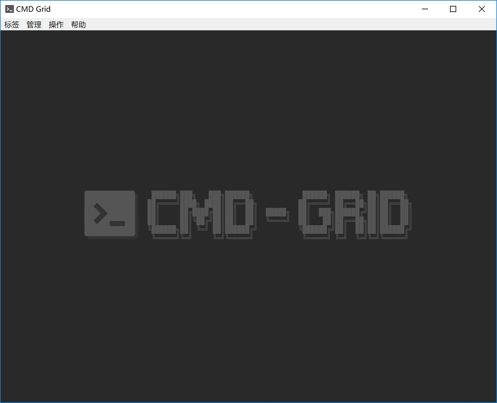
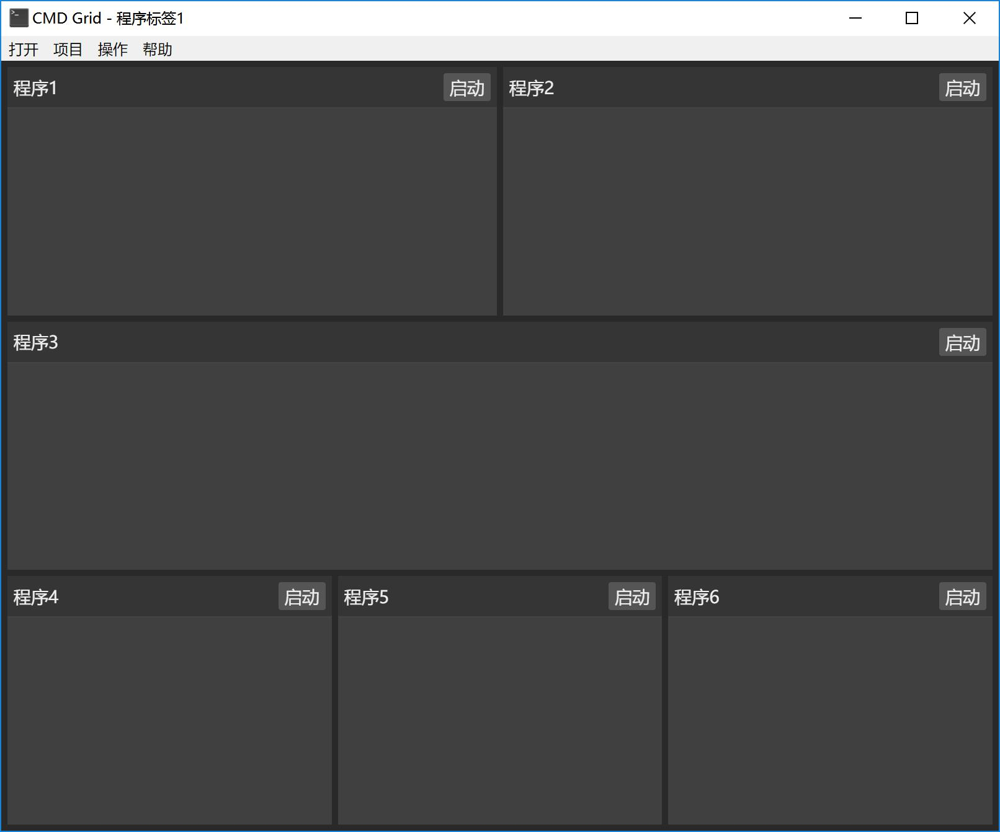
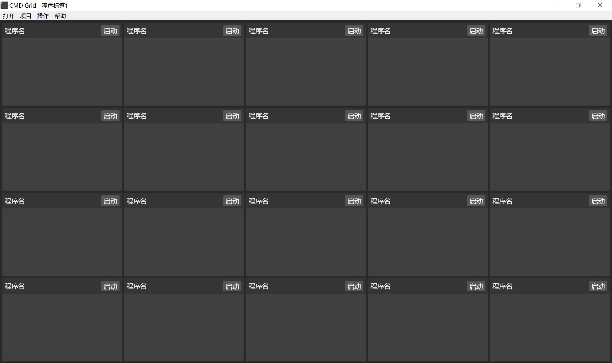
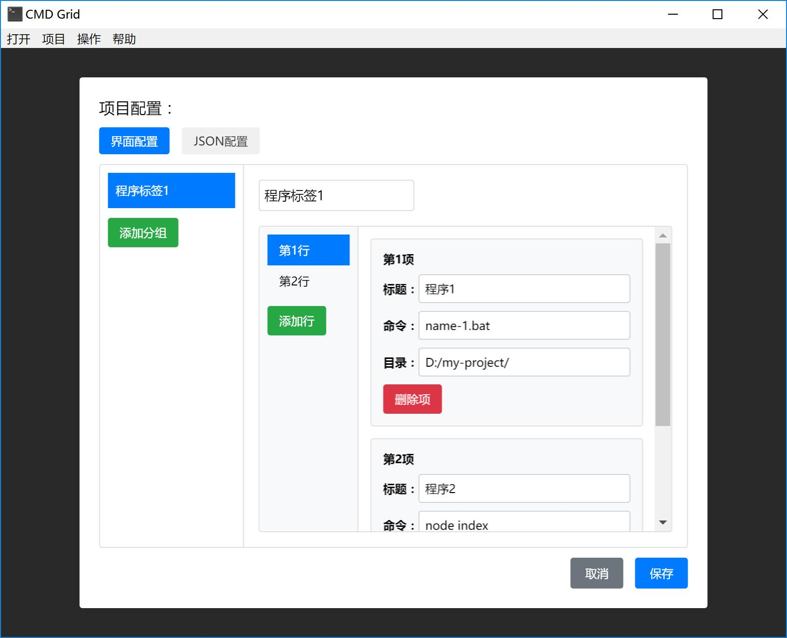

# CMD-Grid 


### CMD-Grid，告别CMD窗口堆叠，让所有程序输出一目了然，轻松监管程序状态。

### 下载
[下载CMD-Grid](https://github.com/sqcddzx/CMD-Grid/releases/tag/CMD)

### 界面

[](./image/example.gif)

[](./image/example-1.jpg)

[](./image/example-2.jpg)

### 配置示例
提供界面配置及json配置
```
[
  {
    "label": "程序标签1",
    "list": [
      [
        {
          "cmd": "node test.js",
          "cwd": "D:/my-project/",
          "title": "node"
        },
        {
          "cmd": "python test.py",
          "cwd": "D:/my-project/",
          "title": "python"
        },
        {
          "cmd": "java -jar test.jar",
          "cwd": "D:/my-project/",
          "title": "java"
        }
      ]
    ]
  }
]
```
[](./image/example-3.jpg)