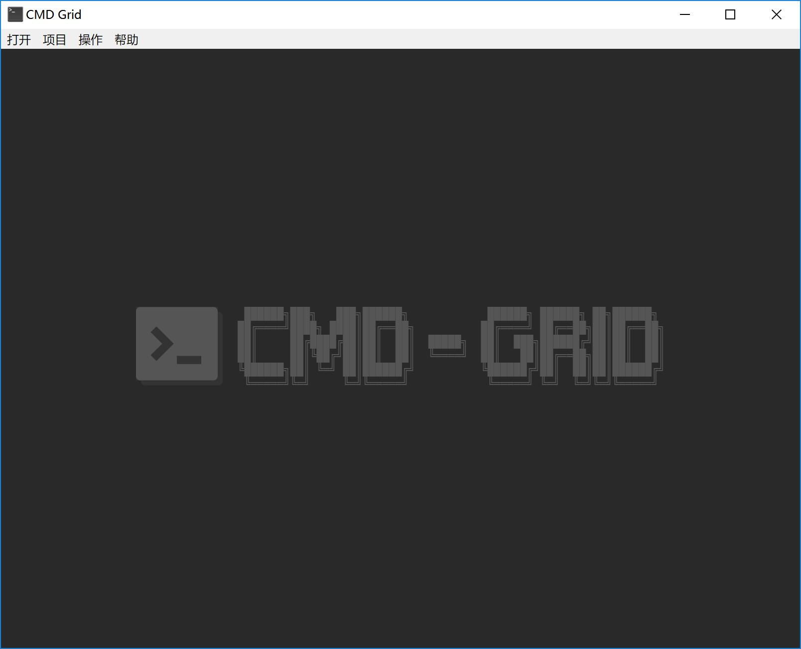

# CMD-Grid 

### CMD-Grid，告别CMD窗口堆叠，让所有程序输出一目了然，轻松监管程序状态。

### 下载
[下载 CMD-Grid.Setup.1.3.8.exe](https://github.com/sqcddzx/CMD-Grid/releases/download/CMD/CMD-Grid.Setup.1.3.8.exe)

### 界面

[](./image/home.jpg)

[](./image/example-1.jpg)


[](./image/example-2.jpg)

### 配置示例
提供界面配置及json配置
```
[
  {
    "label": "程序标签1",
    "list": [
      [
        {
          "cmd": "name-1.bat",
          "cwd": "D:/my-project/",
          "title": "程序1"
        },
        {
          "cmd": "node index",
          "cwd": "D:/my-project/",
          "title": "程序2"
        }
      ],
      [
        {
          "cmd": "name-2.bat",
          "cwd": "D:/my-project/",
          "title": "程序3"
        }
      ]
    ]
  }
]
```
[](./image/example-3.jpg)

### 启动参数
常规打开软件是空界面，如需默认运行某个标签程序，则需添加启动参数，常用于配合计划任务实现开机自启等。  

参数：
```
  标签名: --list=标签名
  启动: --start
```
示例：
```
  1.快捷方式
  C:\yourpath\CMD-Grid.exe --list=标签名 --start

  2.cmd
  start "" "C:\yourpath\CMD-Grid.exe" --list=标签名 --start
```